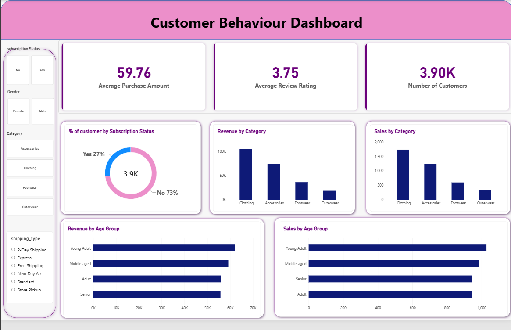

# Customer Shopping Behaviour Analysis

## Project Overview

This project analyses customer shopping behaviour to identify purchasing patterns, revenue drivers and differences across customer segments.

Using SQL, I explored customer demographics, purchasing habits, subscription behaviour, product performance and discount usage. I then developed an interactive Power BI dashboard to present key metrics and trends in a clear format for business decision-making.

## Business Questions

The analysis focused on the following questions:

1. What is the total revenue generated by male and female customers?
2. Which customers used a discount but still spent above the average purchase amount?
3. Which products have the highest average review ratings?
4. How does average purchase amount differ between Standard and Express shipping?
5. Do subscribed customers spend more than non-subscribers?
6. Which products have the highest percentage of discounted purchases?
7. How are customers distributed across New, Returning and Loyal segments?
8. What are the top three most purchased products within each category?
9. Are repeat customers more likely to subscribe?
10. What is the revenue contribution of each age group?

## Dataset

The dataset contains customer shopping records covering demographic information, purchasing behaviour, product preferences, subscription status, discounts, shipping methods and review ratings.

Key fields used in the analysis include:

- Customer ID
- Age and Age Group
- Gender
- Item Purchased
- Category
- Purchase Amount
- Review Rating
- Subscription Status
- Shipping Type
- Discount Applied
- Previous Purchases

## Tools Used

- **PostgreSQL** – querying and analysing customer data
- **SQL** – segmentation, aggregation, subqueries, CTEs and window functions
- **Power BI** – dashboard development and data visualisation

## Analysis Process

1. Reviewed the dataset to understand its structure and customer attributes.
2. Loaded the data into PostgreSQL for analysis.
3. Used SQL to investigate customer spending, product performance, subscription behaviour and customer segments.
4. Used techniques including `CASE` statements, CTEs, subqueries, conditional aggregation and window functions.
5. Built an interactive Power BI dashboard to communicate the main customer and revenue trends.

## Key Insights

- The dataset contains **3,900 customers**, with an average purchase amount of **$59.76** and an average review rating of **3.75**.
- Only **27% of customers are subscribers**, indicating that most customers purchase without an active subscription.
- **Clothing** generates the highest revenue and sales volume among the product categories, making it the strongest-performing category.
- **Accessories** are the second-largest category by both revenue and sales volume.
- **Young Adults** contribute the highest revenue and sales volume among the age groups shown in the dashboard.
- Customer activity can be explored further using interactive filters for **subscription status, gender, product category and shipping type**.

## Recommendations

- Investigate opportunities to increase subscription adoption, particularly among frequent and repeat customers who are not currently subscribed.
- Prioritise high-performing categories such as Clothing and Accessories when planning promotions, while investigating opportunities to improve performance in lower-revenue categories.
- Use customer age and purchasing behaviour to support more targeted marketing and product strategies.
- Analyse discount usage alongside customer spending to determine whether discounts are encouraging valuable purchases or unnecessarily reducing revenue.
- Continue monitoring customer segments and purchasing patterns to identify changes in behaviour over time.

## Dashboard Preview

## Project Files

- [SQL Analysis](Customer_Behaviour.sql)
- [Power BI Dashboard](Customer%20Behaviour%20Dashboard.pbix)
- [Dataset](customer_shopping_behavior.csv)
